# Messy Environment Support - Architecture Document

## Executive Summary

This document specifies the architecture for adding robust support for real-world "messy" migration scenarios where CloudFormation templates, physical resources, and configurations have drifted from ideal states.

**Key Objectives:**
- Enable human intervention at critical decision points
- Discover and match physical AWS resources to logical IDs
- Analyze and classify template differences
- Handle CloudFormation drift gracefully
- Provide interactive guidance during migration

**Architecture Pattern:** Strategy + Observer + Chain of Responsibility

---

## 1. Module Structure

### 1.1 Directory Layout

```
src/modules/
├── intervention/                    # Human intervention system
│   ├── human-intervention-manager.ts
│   ├── intervention-types.ts
│   └── intervention-logger.ts
│
├── discovery/                       # AWS resource discovery
│   ├── aws-resource-discovery.ts   # Main discovery engine
│   ├── resource-matcher.ts         # Matching algorithm
│   ├── physical-id-resolver.ts     # Resolution with fallbacks
│   ├── drift-detector.ts           # CloudFormation drift
│   └── service-clients/            # AWS SDK clients
│       ├── dynamodb-client.ts
│       ├── s3-client.ts
│       ├── lambda-client.ts
│       ├── iam-client.ts
│       └── logs-client.ts
│
├── analysis/                        # Template analysis
│   ├── difference-analyzer.ts      # Classify differences
│   ├── confidence-scoring.ts       # Calculate confidence
│   └── classification-rules.ts     # Rule definitions
│
├── reporter/                        # Reporting system
│   ├── manual-review-report.ts     # Generate reports
│   ├── terminal-formatter.ts       # CLI output
│   └── html-generator.ts           # HTML reports
│
├── importer/                        # Interactive import
│   ├── interactive-cdk-import.ts   # CDK import guidance
│   └── import-monitor.ts           # Process monitoring
│
└── orchestrator/                    # Enhanced orchestrator
    ├── checkpoints.ts              # Checkpoint system (NEW)
    ├── checkpoint-manager.ts       # Manager (NEW)
    ├── index.ts                    # Orchestrator (ENHANCED)
    └── state-machine.ts            # State machine (EXISTING)
```

### 1.2 Module Dependencies


---

## 2. Integration Points

### 2.1 Orchestrator Integration

The `MigrationOrchestrator` is enhanced with a checkpoint system that intercepts the migration flow at critical decision points.

```typescript
// Enhanced MigrationOrchestrator
class MigrationOrchestrator {
  private checkpointManager: CheckpointManager;
  private interventionManager: HumanInterventionManager;

  private async executeMigration(
    state: MigrationState,
    options: OrchestratorOptions
  ): Promise<MigrationState> {
    const allSteps = MigrationStateMachine.getAllSteps();

    for (const step of allSteps) {
      // ✅ CHECKPOINT CHECK - Before executing step
      const checkpoint = this.checkpointManager.shouldTrigger(state, step);

      if (checkpoint) {
        console.log(`🛑 Checkpoint: ${checkpoint.name}`);

        const result = await this.checkpointManager.executeCheckpoint(
          checkpoint,
          state
        );

        if (result.action === 'pause') {
          state.status = MigrationStatus.PAUSED;
          await this.stateManager.saveState(state);
          return state;
        }

        if (result.action === 'abort') {
          state.status = MigrationStatus.FAILED;
          await this.stateManager.saveState(state);
          return state;
        }

        // Apply modifications from checkpoint
        if (result.modifications) {
          state = { ...state, ...result.modifications };
        }
      }

      // Execute step as normal
      const stepResult = await this.executeStep(state, step, options);
      state = await this.stateManager.updateStepResult(state, stepResult);
    }

    return state;
  }
}
```

**Integration Flow:**
1. Orchestrator initializes checkpoint manager
2. Before each step execution, check for registered checkpoints
3. If checkpoint triggers, execute handler
4. Handler returns action: continue, pause, or abort
5. Orchestrator applies modifications and proceeds

### 2.2 Scanner Module Integration

The discovery system integrates with the existing scanner to enhance resource classification.

```typescript
// Enhanced Scanner with Discovery
class Scanner {
  private resourceDiscovery: AWSResourceDiscovery;

  async scan(config: MigrationConfig): Promise<ScanResult> {
    // Existing scan logic
    const resources = await this.parseServerless(config);

    // NEW: Discover actual AWS resources
    if (config.enableDiscovery) {
      const discovered = await this.resourceDiscovery.discoverAll(
        resources.map(r => r.Type)
      );

      // Attach discovery data to resources
      resources.forEach(resource => {
        resource.discoveredResources = discovered.get(resource.Type) || [];
      });
    }

    return { resources };
  }
}
```

**Integration Points:**
- Scanner provides logical resources from templates
- Discovery finds physical resources in AWS
- ResourceMatcher correlates the two
- Results stored in migration state for checkpoints

### 2.3 Comparator Integration

The analysis modules enhance the comparator with classification and confidence scoring.

```typescript
// Enhanced Comparator
class Comparator {
  private differenceAnalyzer: DifferenceAnalyzer;
  private confidenceScoring: ConfidenceScoring;

  async compareTemplates(
    slsPath: string,
    cdkPath: string
  ): Promise<ComparisonReport> {
    // Existing comparison logic
    const differences = await this.findDifferences(slsPath, cdkPath);

    // NEW: Analyze and classify differences
    const classifications = this.differenceAnalyzer.analyzeDifferences(
      differences
    );

    // NEW: Calculate confidence scores
    const confidenceScores = new Map<string, ConfidenceScore>();
    for (const resource of this.resources) {
      const score = this.confidenceScoring.calculateResourceConfidence(
        resource,
        resource.matchResult,
        classifications.filter(c => c.resourceId === resource.LogicalId)
      );
      confidenceScores.set(resource.LogicalId, score);
    }

    return {
      differences,
      classifications,
      confidenceScores,
      summary: this.generateSummary(classifications)
    };
  }
}
```

**Integration Points:**
- Comparator finds differences using existing logic
- DifferenceAnalyzer classifies each difference
- ConfidenceScoring provides migration confidence
- Results feed into checkpoints for human review

### 2.4 Checkpoint System Flow


---

## 3. Data Flow Diagrams

### 3.1 Physical ID Resolution Flow

```mermaid
flowchart TD
    START[Resource needs physical ID] --> STRAT1[Strategy 1: Explicit ID]

    STRAT1 --> CHECK1{Has explicit<br/>physical ID?}
    CHECK1 -->|Yes| SUCCESS1[✅ Return explicit ID]
    CHECK1 -->|No| STRAT2[Strategy 2: Auto-Discovery]

    STRAT2 --> DISC[Discover AWS resources]
    DISC --> MATCH[Match with confidence scoring]
    MATCH --> CHECK2{Confidence >= 90%?}
    CHECK2 -->|Yes| SUCCESS2[✅ Auto-select best match]
    CHECK2 -->|No| STRAT3[Strategy 3: Human Selection]

    STRAT3 --> PROMPT[Present candidates to user]
    PROMPT --> USER{User selects}
    USER -->|Select candidate| SUCCESS3[✅ Use selected ID]
    USER -->|Enter manually| SUCCESS4[✅ Use manual ID]
    USER -->|Skip| SKIP[Skip resource]

    SUCCESS1 --> LOG[Log resolution]
    SUCCESS2 --> LOG
    SUCCESS3 --> LOG
    SUCCESS4 --> LOG

    LOG --> END[Physical ID resolved]
    SKIP --> END
```



### 3.2 Template Comparison with Human Review


### 3.3 Interactive Import Process


### 3.4 Checkpoint Execution Sequence


---

## 4. Design Patterns

### 4.1 Strategy Pattern for Resolution Fallbacks

The `PhysicalIdResolver` uses the Strategy pattern to implement cascading fallback strategies.

```typescript
/**
 * Strategy Pattern Implementation
 */

interface ResolutionStrategy {
  name: string;
  confidence: number;
  execute(context: ResolutionContext): Promise<string | null>;
}

class ExplicitIdStrategy implements ResolutionStrategy {
  name = 'Explicit Physical ID';
  confidence = 1.0;

  async execute(context: ResolutionContext): Promise<string | null> {
    const physicalIdProp = getPhysicalIdProperty(context.resourceType);
    return context.templateProperties[physicalIdProp] || null;
  }
}

class AutoDiscoveryStrategy implements ResolutionStrategy {
  name = 'Auto-Discovery';
  confidence = 0.7;

  constructor(
    private discovery: AWSResourceDiscovery,
    private matcher: ResourceMatcher
  ) {}

  async execute(context: ResolutionContext): Promise<string | null> {
    const discovered = await this.discovery.discoverResourceType(
      context.resourceType
    );

    const matchResult = this.matcher.match(
      context.logicalId,
      context.resourceType,
      context.templateProperties,
      discovered
    );

    if (matchResult.bestMatch && matchResult.bestMatch.confidence >= 0.9) {
      return matchResult.bestMatch.physicalId;
    }

    return null;
  }
}

class HumanSelectionStrategy implements ResolutionStrategy {
  name = 'Human Selection';
  confidence = 1.0;

  constructor(private interventionManager: HumanInterventionManager) {}

  async execute(context: ResolutionContext): Promise<string | null> {
    // Always succeeds (human can always provide answer)
    return await this.interventionManager.promptForPhysicalId(
      context.logicalId,
      context.resourceType,
      context.candidates
    );
  }
}

class PhysicalIdResolver {
  private strategies: ResolutionStrategy[];

  constructor(
    discovery: AWSResourceDiscovery,
    matcher: ResourceMatcher,
    interventionManager: HumanInterventionManager
  ) {
    this.strategies = [
      new ExplicitIdStrategy(),
      new AutoDiscoveryStrategy(discovery, matcher),
      new HumanSelectionStrategy(interventionManager)
    ];
  }

  async resolve(context: ResolutionContext): Promise<string> {
    for (const strategy of this.strategies) {
      const result = await strategy.execute(context);
      if (result) {
        console.log(`✅ Resolved using ${strategy.name}`);
        return result;
      }
    }

    throw new Error('All resolution strategies failed');
  }
}
```

**Benefits:**
- Easy to add new resolution strategies
- Strategies can be reordered or disabled
- Clear separation of concerns
- Testable in isolation

### 4.2 Observer Pattern for Process Monitoring

The `InteractiveCDKImport` uses the Observer pattern to monitor CDK process output.

```typescript
/**
 * Observer Pattern Implementation
 */

interface ProcessObserver {
  onOutput(data: string): void;
  onError(error: string): void;
  onComplete(code: number): void;
}

class ProgressObserver implements ProcessObserver {
  private currentResource: string = '';

  onOutput(data: string): void {
    console.log(data);

    if (data.includes('Importing')) {
      this.currentResource = this.extractResource(data);
      console.log(`📥 Importing ${this.currentResource}...`);
    }

    if (data.includes('✅')) {
      console.log(`  ✅ Imported: ${this.currentResource}`);
    }
  }

  onError(error: string): void {
    console.error(`❌ Error: ${error}`);
  }

  onComplete(code: number): void {
    if (code === 0) {
      console.log('✅ Import completed successfully');
    } else {
      console.error(`❌ Import failed with code ${code}`);
    }
  }

  private extractResource(output: string): string {
    const match = output.match(/Importing (.+)/);
    return match ? match[1] : '';
  }
}

class MetricsObserver implements ProcessObserver {
  private startTime: number = Date.now();
  private resourceCount: number = 0;

  onOutput(data: string): void {
    if (data.includes('✅')) {
      this.resourceCount++;
    }
  }

  onError(error: string): void {
    // Track errors
  }

  onComplete(code: number): void {
    const duration = Date.now() - this.startTime;
    console.log(`\n📊 Import metrics:`);
    console.log(`  Resources: ${this.resourceCount}`);
    console.log(`  Duration: ${duration}ms`);
    console.log(`  Rate: ${(this.resourceCount / (duration / 1000)).toFixed(2)} res/sec`);
  }
}

class ProcessMonitor {
  private observers: ProcessObserver[] = [];

  attach(observer: ProcessObserver): void {
    this.observers.push(observer);
  }

  notifyOutput(data: string): void {
    this.observers.forEach(o => o.onOutput(data));
  }

  notifyError(error: string): void {
    this.observers.forEach(o => o.onError(error));
  }

  notifyComplete(code: number): void {
    this.observers.forEach(o => o.onComplete(code));
  }
}

class InteractiveCDKImport {
  private monitor: ProcessMonitor;

  constructor() {
    this.monitor = new ProcessMonitor();
    this.monitor.attach(new ProgressObserver());
    this.monitor.attach(new MetricsObserver());
  }

  async runImport(cdkProjectPath: string): Promise<ImportResult> {
    const cdkProcess = spawn('npx', ['cdk', 'import'], {
      cwd: cdkProjectPath
    });

    cdkProcess.stdout.on('data', (data) => {
      this.monitor.notifyOutput(data.toString());
    });

    cdkProcess.stderr.on('data', (data) => {
      this.monitor.notifyError(data.toString());
    });

    cdkProcess.on('close', (code) => {
      this.monitor.notifyComplete(code || 0);
    });

    // ... rest of implementation
  }
}
```

**Benefits:**
- Multiple observers can monitor same process
- Observers are independent and reusable
- Easy to add new monitoring capabilities
- Clean separation of monitoring logic

### 4.3 Chain of Responsibility for Checkpoints

The `CheckpointManager` uses Chain of Responsibility to process checkpoints in order.

```typescript
/**
 * Chain of Responsibility Pattern Implementation
 */

abstract class CheckpointHandler {
  protected next: CheckpointHandler | null = null;

  setNext(handler: CheckpointHandler): CheckpointHandler {
    this.next = handler;
    return handler;
  }

  async handle(
    state: MigrationState,
    step: MigrationStep
  ): Promise<CheckpointResult | null> {
    if (this.shouldHandle(state, step)) {
      return await this.execute(state);
    }

    if (this.next) {
      return await this.next.handle(state, step);
    }

    return null;
  }

  protected abstract shouldHandle(
    state: MigrationState,
    step: MigrationStep
  ): boolean;

  protected abstract execute(
    state: MigrationState
  ): Promise<CheckpointResult>;
}

class PhysicalIdCheckpointHandler extends CheckpointHandler {
  constructor(private resolver: PhysicalIdResolver) {
    super();
  }

  protected shouldHandle(state: MigrationState, step: MigrationStep): boolean {
    return (
      step === MigrationStep.DISCOVERY &&
      state.resources.some(r => r.isStateful && !r.physicalId)
    );
  }

  protected async execute(state: MigrationState): Promise<CheckpointResult> {
    const unresolved = state.resources.filter(
      r => r.isStateful && !r.physicalId
    );

    for (const resource of unresolved) {
      const physicalId = await this.resolver.resolve({
        logicalId: resource.LogicalId,
        resourceType: resource.Type,
        templateProperties: resource.Properties
      });

      resource.physicalId = physicalId;
    }

    return {
      action: 'continue',
      modifications: { resources: state.resources }
    };
  }
}

class DriftCheckpointHandler extends CheckpointHandler {
  constructor(private driftDetector: DriftDetector) {
    super();
  }

  protected shouldHandle(state: MigrationState, step: MigrationStep): boolean {
    return (
      step === MigrationStep.TEMPLATE_MODIFICATION &&
      state.config.detectDrift === true
    );
  }

  protected async execute(state: MigrationState): Promise<CheckpointResult> {
    const driftMap = await this.driftDetector.detectDrift(
      state.config.stackName
    );

    const drifted = Array.from(driftMap.values()).filter(d => d.drifted);

    if (drifted.length === 0) {
      return { action: 'continue' };
    }

    // Handle drift...
    return { action: 'continue' };
  }
}

class CheckpointManager {
  private chain: CheckpointHandler;

  constructor(
    resolver: PhysicalIdResolver,
    driftDetector: DriftDetector,
    // ... other dependencies
  ) {
    // Build chain
    const physicalIdHandler = new PhysicalIdCheckpointHandler(resolver);
    const driftHandler = new DriftCheckpointHandler(driftDetector);

    physicalIdHandler.setNext(driftHandler);

    this.chain = physicalIdHandler;
  }

  async executeCheckpoint(
    state: MigrationState,
    step: MigrationStep
  ): Promise<CheckpointResult | null> {
    return await this.chain.handle(state, step);
  }
}
```

**Benefits:**
- Checkpoints processed in defined order
- Easy to add/remove/reorder checkpoints
- Each checkpoint is independent
- Clear responsibility separation

### 4.4 Factory Pattern for AWS Service Clients

AWS SDK clients are created using the Factory pattern for consistency and testability.

```typescript
/**
 * Factory Pattern Implementation
 */

interface AWSServiceClient {
  discoverResources(): Promise<DiscoveredResource[]>;
}

class DynamoDBDiscoveryClient implements AWSServiceClient {
  private client: DynamoDBClient;

  constructor(region: string) {
    this.client = new DynamoDBClient({ region });
  }

  async discoverResources(): Promise<DiscoveredResource[]> {
    const tables = await this.listTables();
    return Promise.all(tables.map(t => this.describeTable(t)));
  }

  private async listTables(): Promise<string[]> {
    const command = new ListTablesCommand({});
    const response = await this.client.send(command);
    return response.TableNames || [];
  }

  private async describeTable(tableName: string): Promise<DiscoveredResource> {
    const command = new DescribeTableCommand({ TableName: tableName });
    const response = await this.client.send(command);

    return {
      physicalId: tableName,
      resourceType: 'AWS::DynamoDB::Table',
      region: this.region,
      arn: response.Table?.TableArn || '',
      tags: await this.getTags(tableName),
      createdAt: response.Table?.CreationDateTime,
      metadata: {
        keySchema: response.Table?.KeySchema,
        billingMode: response.Table?.BillingModeSummary?.BillingMode
      }
    };
  }
}

class S3DiscoveryClient implements AWSServiceClient {
  private client: S3Client;

  constructor(region: string) {
    this.client = new S3Client({ region });
  }

  async discoverResources(): Promise<DiscoveredResource[]> {
    const buckets = await this.listBuckets();
    return Promise.all(buckets.map(b => this.describeBucket(b)));
  }

  // ... implementation
}

class AWSServiceClientFactory {
  private static clientRegistry = new Map<string, typeof AWSServiceClient>();

  static register(resourceType: string, clientClass: typeof AWSServiceClient) {
    this.clientRegistry.set(resourceType, clientClass);
  }

  static create(resourceType: string, region: string): AWSServiceClient {
    const ClientClass = this.clientRegistry.get(resourceType);

    if (!ClientClass) {
      throw new Error(`No client registered for ${resourceType}`);
    }

    return new ClientClass(region);
  }
}

// Register clients
AWSServiceClientFactory.register(
  'AWS::DynamoDB::Table',
  DynamoDBDiscoveryClient
);
AWSServiceClientFactory.register(
  'AWS::S3::Bucket',
  S3DiscoveryClient
);

// Usage
class AWSResourceDiscovery {
  async discoverResourceType(resourceType: string): Promise<DiscoveredResource[]> {
    const client = AWSServiceClientFactory.create(resourceType, this.region);
    return await client.discoverResources();
  }
}
```

**Benefits:**
- Consistent client creation
- Easy to mock for testing
- Centralized registration
- Type-safe client creation

---

## 5. Technology Stack

### 5.1 AWS SDK v3 Services

```typescript
// AWS SDK v3 packages
import { DynamoDBClient, ListTablesCommand, DescribeTableCommand } from '@aws-sdk/client-dynamodb';
import { S3Client, ListBucketsCommand, GetBucketLocationCommand } from '@aws-sdk/client-s3';
import { LambdaClient, ListFunctionsCommand, GetFunctionCommand } from '@aws-sdk/client-lambda';
import { IAMClient, ListRolesCommand, GetRoleCommand } from '@aws-sdk/client-iam';
import { CloudWatchLogsClient, DescribeLogGroupsCommand } from '@aws-sdk/client-cloudwatch-logs';
import { CloudFormationClient, DetectStackDriftCommand, DescribeStackResourceDriftsCommand } from '@aws-sdk/client-cloudformation';
```

**Package Dependencies:**
```json
{
  "dependencies": {
    "@aws-sdk/client-dynamodb": "^3.450.0",
    "@aws-sdk/client-s3": "^3.450.0",
    "@aws-sdk/client-lambda": "^3.450.0",
    "@aws-sdk/client-iam": "^3.450.0",
    "@aws-sdk/client-cloudwatch-logs": "^3.450.0",
    "@aws-sdk/client-cloudformation": "^3.450.0"
  }
}
```

### 5.2 CLI Libraries

```typescript
// Interactive prompts
import inquirer from 'inquirer';
import { input, select, confirm, checkbox } from '@inquirer/prompts';

// Terminal styling
import chalk from 'chalk';
import boxen from 'boxen';
import ora from 'ora';
import figures from 'figures';

// Table formatting
import Table from 'cli-table3';
import columnify from 'columnify';
```

**Package Dependencies:**
```json
{
  "dependencies": {
    "inquirer": "^9.2.0",
    "@inquirer/prompts": "^3.0.0",
    "chalk": "^5.3.0",
    "boxen": "^7.1.0",
    "ora": "^7.0.0",
    "figures": "^6.0.0",
    "cli-table3": "^0.6.3",
    "columnify": "^1.6.0"
  }
}
```

### 5.3 Process Management

```typescript
import { spawn, ChildProcess, SpawnOptions } from 'child_process';
import { EventEmitter } from 'events';
```

**Process Monitoring:**
- Spawn CDK import process
- Monitor stdout/stderr streams
- Handle process events (exit, error, close)
- Send input to stdin for interactive prompts

### 5.4 Testing Frameworks

```typescript
// Unit testing
import { describe, it, expect, jest, beforeEach, afterEach } from '@jest/globals';
import { mock, mockDeep, mockReset } from 'jest-mock-extended';

// Integration testing
import { TestEnvironment } from './test-utils/environment';
import { MockAWSClients } from './test-utils/aws-mocks';
```

**Package Dependencies:**
```json
{
  "devDependencies": {
    "jest": "^29.6.0",
    "@types/jest": "^29.5.0",
    "jest-mock-extended": "^3.0.5",
    "ts-jest": "^29.1.0"
  }
}
```

---

## 6. Error Handling Strategy

### 6.1 Graceful Degradation

The system degrades gracefully when automatic resolution fails.

```typescript
class PhysicalIdResolver {
  async resolve(context: ResolutionContext): Promise<string> {
    try {
      // Try explicit ID
      const explicitId = this.getExplicitId(context);
      if (explicitId) {
        return explicitId;
      }
    } catch (error) {
      this.logger.warn('Explicit ID strategy failed', error);
      // Continue to next strategy
    }

    try {
      // Try auto-discovery
      const discoveredId = await this.autoDiscover(context);
      if (discoveredId) {
        return discoveredId;
      }
    } catch (error) {
      this.logger.warn('Auto-discovery strategy failed', error);
      // Fall back to human intervention
    }

    // Always succeeds with human intervention
    return await this.humanSelection(context);
  }
}
```

**Degradation Levels:**
1. **Full Auto:** Explicit ID or high-confidence match (>90%)
2. **Semi-Auto:** Low-confidence match, prompt for confirmation
3. **Manual:** No match found, prompt for selection/input
4. **Skip:** User chooses to skip resource

### 6.2 Retry Mechanisms

AWS API calls use exponential backoff retry.

```typescript
class AWSDiscoveryClient {
  private async retryWithBackoff<T>(
    operation: () => Promise<T>,
    maxRetries: number = 3
  ): Promise<T> {
    let lastError: Error;

    for (let attempt = 0; attempt < maxRetries; attempt++) {
      try {
        return await operation();
      } catch (error) {
        lastError = error as Error;

        // Don't retry on permission errors
        if (this.isPermissionError(error)) {
          throw error;
        }

        // Exponential backoff: 1s, 2s, 4s
        const delay = Math.pow(2, attempt) * 1000;
        await this.sleep(delay);

        this.logger.warn(`Retry attempt ${attempt + 1}/${maxRetries}`, {
          error: lastError.message
        });
      }
    }

    throw new Error(
      `Failed after ${maxRetries} retries: ${lastError!.message}`
    );
  }

  async discoverResources(): Promise<DiscoveredResource[]> {
    return await this.retryWithBackoff(async () => {
      const client = new DynamoDBClient({ region: this.region });
      const command = new ListTablesCommand({});
      const response = await client.send(command);
      return this.processResponse(response);
    });
  }
}
```

**Retry Strategy:**
- Max 3 retries with exponential backoff
- Don't retry on permission errors
- Log retry attempts for debugging
- Throw after max retries exceeded

### 6.3 User Notification Patterns

Users are notified of errors with context and recovery options.

```typescript
class HumanInterventionManager {
  async handleError(
    error: Error,
    context: ErrorContext
  ): Promise<ErrorResolution> {
    const errorType = this.classifyError(error);

    switch (errorType) {
      case 'PERMISSION_DENIED':
        return await this.handlePermissionError(error, context);

      case 'RESOURCE_NOT_FOUND':
        return await this.handleNotFoundError(error, context);

      case 'API_THROTTLED':
        return await this.handleThrottleError(error, context);

      default:
        return await this.handleUnknownError(error, context);
    }
  }

  private async handlePermissionError(
    error: Error,
    context: ErrorContext
  ): Promise<ErrorResolution> {
    console.log(boxen(
      chalk.red.bold('❌ Permission Denied\n\n') +
      chalk.white(`AWS API call failed: ${error.message}\n\n`) +
      chalk.yellow('Required permission:\n') +
      chalk.cyan(`  ${this.getRequiredPermission(context)}\n\n`) +
      chalk.white('Options:\n') +
      chalk.white('  1. Add permission to IAM role/user\n') +
      chalk.white('  2. Skip this resource\n') +
      chalk.white('  3. Abort migration'),
      { padding: 1, margin: 1, borderColor: 'red' }
    ));

    const response = await this.prompt({
      type: 'choice',
      severity: 'critical',
      question: 'How would you like to proceed?',
      options: [
        { value: 'retry', label: 'Retry (after fixing permissions)' },
        { value: 'skip', label: 'Skip this resource' },
        { value: 'abort', label: 'Abort migration' }
      ]
    });

    return {
      action: response.action as 'retry' | 'skip' | 'abort',
      timestamp: new Date()
    };
  }
}
```

**Notification Levels:**
- **Info:** Blue boxes, informational messages
- **Warning:** Yellow boxes, requires attention
- **Critical:** Red boxes, blocking issues
- **Success:** Green boxes, completion messages

### 6.4 State Recovery

The system can recover from interruptions by saving state frequently.

```typescript
class StateManager {
  async saveState(state: MigrationState): Promise<void> {
    try {
      // Save to primary location
      await this.saveToPrimary(state);

      // Create backup
      if (state.config.backupEnabled) {
        await this.saveToBackup(state);
      }
    } catch (error) {
      this.logger.error('Failed to save state', error);

      // Try alternative save location
      try {
        await this.saveToAlternative(state);
      } catch (altError) {
        // Critical failure - state lost
        throw new Error(
          'Failed to save migration state: ' + (error as Error).message
        );
      }
    }
  }

  async recoverState(stateId: string): Promise<MigrationState> {
    // Try primary location
    try {
      return await this.loadFromPrimary(stateId);
    } catch (error) {
      this.logger.warn('Failed to load from primary', error);
    }

    // Try backup location
    try {
      return await this.loadFromBackup(stateId);
    } catch (error) {
      this.logger.warn('Failed to load from backup', error);
    }

    // Try alternative location
    try {
      return await this.loadFromAlternative(stateId);
    } catch (error) {
      throw new Error(`Cannot recover state ${stateId}: all locations failed`);
    }
  }
}
```

**Recovery Points:**
- Before each checkpoint execution
- After each successful step
- Before critical operations (import, deploy)
- On user request (manual checkpoint)

---

## 7. Component Specifications

### 7.1 HumanInterventionManager

**Responsibility:** Central hub for all user interactions during migration.

**Interface:**
```typescript
interface InterventionPrompt {
  id: string;
  type: 'choice' | 'confirm' | 'input';
  severity: 'info' | 'warning' | 'critical';
  question: string;
  context?: string;
  options?: InterventionOption[];
  defaultValue?: string;
  allowSkip?: boolean;
}

interface InterventionResponse {
  promptId: string;
  action: 'proceed' | 'skip' | 'abort' | 'manual' | string;
  value?: string;
  timestamp: Date;
}

class HumanInterventionManager {
  async prompt(prompt: InterventionPrompt): Promise<InterventionResponse>;
  async promptForPhysicalId(logicalId: string, type: string, candidates: Candidate[]): Promise<string>;
  async confirmCriticalDifference(resourceId: string, diffs: Difference[]): Promise<'proceed' | 'abort' | 'manual'>;
  async resolveDrift(resourceId: string, drift: DriftInfo): Promise<'use-aws' | 'use-template' | 'manual'>;
  recordIntervention(response: InterventionResponse): void;
  getInterventionHistory(migrationId: string): InterventionResponse[];
}
```

**Dependencies:**
- `inquirer` for interactive prompts
- `chalk` for colored output
- `boxen` for styled boxes
- `ora` for spinners

### 7.2 AWSResourceDiscovery

**Responsibility:** Discover actual AWS resources in the account.

**Interface:**
```typescript
interface DiscoveredResource {
  physicalId: string;
  resourceType: string;
  region: string;
  arn: string;
  tags: Record<string, string>;
  createdAt?: Date;
  metadata: Record<string, any>;
}

class AWSResourceDiscovery {
  async discoverResourceType(type: string, region?: string): Promise<DiscoveredResource[]>;
  async discoverDynamoDBTables(): Promise<DiscoveredResource[]>;
  async discoverS3Buckets(): Promise<DiscoveredResource[]>;
  async discoverLogGroups(prefix?: string): Promise<DiscoveredResource[]>;
  async discoverLambdaFunctions(): Promise<DiscoveredResource[]>;
  async discoverIAMRoles(pathPrefix?: string): Promise<DiscoveredResource[]>;
  async discoverAll(types: string[]): Promise<Map<string, DiscoveredResource[]>>;
}
```

**Dependencies:**
- AWS SDK v3 clients
- Service-specific client factories
- Retry logic with backoff

### 7.3 ResourceMatcher

**Responsibility:** Match logical IDs to physical resources with confidence scoring.

**Interface:**
```typescript
interface MatchCandidate {
  physicalId: string;
  confidence: number;
  matchReasons: string[];
  discoveredResource: DiscoveredResource;
}

interface MatchResult {
  logicalId: string;
  resourceType: string;
  matches: MatchCandidate[];
  bestMatch?: MatchCandidate;
  requiresHumanReview: boolean;
}

class ResourceMatcher {
  match(logicalId: string, type: string, props: Record<string, any>, discovered: DiscoveredResource[]): MatchResult;
  private calculateConfidence(props: Record<string, any>, discovered: DiscoveredResource): { score: number; reasons: string[] };
  private calculateSimilarity(str1: string, str2: string): number;
  private tagsMatch(templateTags: any, discoveredTags: Record<string, string>): boolean;
}
```

**Confidence Factors:**
- Exact name match: 90%
- Name similarity: 0-50%
- Tag match: +20%
- Configuration match: +30%
- Recent creation: +10%

### 7.4 PhysicalIdResolver

**Responsibility:** Resolve physical IDs using cascading strategies.

**Interface:**
```typescript
interface ResolutionContext {
  logicalId: string;
  resourceType: string;
  templateProperties: Record<string, any>;
  candidates?: Candidate[];
}

class PhysicalIdResolver {
  async resolve(context: ResolutionContext): Promise<string>;
  private getStrategies(context: ResolutionContext): ResolutionStrategy[];
}
```

**Strategies:**
1. Explicit physical ID from template
2. Auto-discovery with high confidence
3. Human selection

### 7.5 DifferenceAnalyzer

**Responsibility:** Classify template differences by severity and resolvability.

**Interface:**
```typescript
interface DifferenceClassification {
  difference: Difference;
  category: 'acceptable' | 'warning' | 'critical';
  autoResolvable: boolean;
  resolutionStrategy?: string;
  requiresHumanReview: boolean;
  explanation: string;
}

class DifferenceAnalyzer {
  analyzeDifferences(diffs: Difference[]): DifferenceClassification[];
  groupByResolution(classifications: DifferenceClassification[]): { autoResolvable: DifferenceClassification[]; requiresReview: DifferenceClassification[] };
  explainDifference(diff: Difference): string;
}
```

**Classification Rules:**
- Metadata additions: Acceptable
- UpdateReplacePolicy: Acceptable
- Attribute definitions: Warning
- Physical resource names: Critical

### 7.6 ConfidenceScoring

**Responsibility:** Calculate confidence scores for migration decisions.

**Interface:**
```typescript
interface ConfidenceScore {
  overall: number;
  factors: ConfidenceFactor[];
  recommendation: 'auto-proceed' | 'review-recommended' | 'human-required';
}

class ConfidenceScoring {
  calculateMigrationConfidence(state: MigrationState, step: MigrationStep): ConfidenceScore;
  calculateResourceConfidence(resource: ClassifiedResource, match?: MatchResult, diffs?: DifferenceClassification[]): ConfidenceScore;
}
```

**Scoring Logic:**
- Physical ID match: 0-100%
- Critical differences: -70%
- Warning differences: -30%
- Complex resource types: -20%

### 7.7 CheckpointManager

**Responsibility:** Manage and execute checkpoints during migration.

**Interface:**
```typescript
interface Checkpoint {
  id: string;
  step: MigrationStep;
  name: string;
  description: string;
  condition: (state: MigrationState) => boolean;
  handler: (state: MigrationState) => Promise<CheckpointResult>;
}

interface CheckpointResult {
  action: 'continue' | 'pause' | 'abort';
  modifications?: Partial<MigrationState>;
}

class CheckpointManager {
  registerCheckpoint(checkpoint: Checkpoint): void;
  shouldTrigger(state: MigrationState, step: MigrationStep): Checkpoint | null;
  async executeCheckpoint(checkpoint: Checkpoint, state: MigrationState): Promise<CheckpointResult>;
}
```

**Predefined Checkpoints:**
1. Physical ID resolution (DISCOVERY step)
2. Critical differences review (COMPARISON step)
3. Drift detection (TEMPLATE_MODIFICATION step)
4. CDK import execution (IMPORT_PREPARATION step)

---

## 8. Security Considerations

### 8.1 AWS Credentials

- Use AWS credential chain (environment, profile, IAM role)
- Never log or display credentials
- Support AWS SSO and temporary credentials
- Respect AWS credential expiration

### 8.2 Sensitive Data

- Mask sensitive values in logs (API keys, passwords)
- Redact sensitive properties in reports
- Secure intervention history (contains user decisions)
- Encrypt state files if they contain secrets

### 8.3 Audit Trail

- Log all user interventions with timestamps
- Record all AWS API calls for compliance
- Track confidence scores and reasoning
- Exportable audit log for review

---

## 9. Performance Considerations

### 9.1 AWS API Rate Limiting

- Batch API calls when possible
- Use pagination for large result sets
- Implement exponential backoff
- Cache discovery results

### 9.2 Progress Indication

- Real-time progress bars for long operations
- Estimated time remaining
- Resource-level progress tracking
- Cancellable operations

### 9.3 Parallel Discovery

- Discover multiple resource types in parallel
- Use worker threads for CPU-intensive operations
- Stream large result sets
- Lazy load detailed resource information

---

## 10. Testing Strategy

### 10.1 Unit Tests

- Test each module in isolation
- Mock AWS SDK clients
- Mock user interventions
- Test confidence scoring algorithms
- Test matching algorithms

### 10.2 Integration Tests

- Test complete flows (discovery → matching → resolution)
- Test checkpoint execution
- Test error handling and recovery
- Test state persistence and recovery

### 10.3 End-to-End Tests

- Test complete migration with messy environment
- Test pause/resume functionality
- Test rollback scenarios
- Test with real AWS resources (in test account)

---

## 11. Metrics and Observability

### 11.1 Key Metrics

- **Discovery Performance**
  - Resources discovered per second
  - API call count and latency
  - Cache hit rate

- **Matching Accuracy**
  - Average confidence score
  - Auto-match success rate
  - Human intervention rate

- **Migration Progress**
  - Time per step
  - Checkpoint frequency
  - Pause/resume cycles

### 11.2 Logging

```typescript
// Structured logging with context
logger.info('Physical ID resolved', {
  logicalId: 'UsersTable',
  physicalId: 'users-table-dev',
  strategy: 'auto-discovery',
  confidence: 0.92,
  duration: 1234
});

logger.warn('Low confidence match', {
  logicalId: 'ApiRole',
  candidates: 3,
  bestConfidence: 0.65,
  requiresHumanReview: true
});

logger.error('Discovery failed', {
  resourceType: 'AWS::DynamoDB::Table',
  error: error.message,
  retryCount: 3
});
```

---

## 12. Future Enhancements

### 12.1 Machine Learning

- Train model on intervention history
- Predict likely physical IDs
- Improve confidence scoring with ML
- Auto-learn from user corrections

### 12.2 Multi-Account Discovery

- Scan resources across multiple AWS accounts
- Handle cross-account references
- Organization-level discovery
- Consolidate resources from multiple regions

### 12.3 Advanced Drift Resolution

- Automatic drift correction
- Drift prediction before migration
- Smart drift merging strategies
- Drift impact analysis

---

## Appendix A: ASCII Diagrams

### System Architecture

```
┌─────────────────────────────────────────────────────────────────┐
│                     Migration Orchestrator                       │
│                  (Enhanced with Checkpoints)                     │
└────────┬───────────────────────────────────────────────────────┬┘
         │                                                         │
         ├─── 🛑 Checkpoint: Physical ID Resolution               │
         │    └─→ AWSResourceDiscovery                            │
         │        └─→ ResourceMatcher                             │
         │            └─→ PhysicalIdResolver                      │
         │                └─→ HumanInterventionManager            │
         │                                                         │
         ├─── 🛑 Checkpoint: Template Difference Review           │
         │    └─→ DifferenceAnalyzer                              │
         │        └─→ ConfidenceScoring                           │
         │            └─→ ManualReviewReport                      │
         │                └─→ HumanInterventionManager            │
         │                                                         │
         ├─── 🛑 Checkpoint: Drift Detection                      │
         │    └─→ DriftDetector                                   │
         │        └─→ HumanInterventionManager                    │
         │                                                         │
         └─── 🛑 Checkpoint: CDK Import Execution                 │
              └─→ InteractiveCDKImport                            │
                  └─→ HumanInterventionManager                    │
```

### Resolution Strategy Cascade

```
┌───────────────────────────────────────────────────────────┐
│            Physical ID Resolution Cascade                 │
└───────────────────────────────────────────────────────────┘
                          │
                          ▼
            ┌─────────────────────────┐
            │  Strategy 1: Explicit   │
            │  Confidence: 100%       │
            └─────────┬───────────────┘
                      │ Has explicit ID?
                      ├─YES──→ ✅ Success
                      │
                      NO
                      ▼
            ┌─────────────────────────┐
            │  Strategy 2: Discovery  │
            │  Confidence: 70%+       │
            └─────────┬───────────────┘
                      │ Confidence >= 90%?
                      ├─YES──→ ✅ Success
                      │
                      NO
                      ▼
            ┌─────────────────────────┐
            │  Strategy 3: Human      │
            │  Confidence: 100%       │
            └─────────┬───────────────┘
                      │ User selects
                      └──→ ✅ Success
```

---

## Appendix B: Configuration Examples

### Migration Config with Messy Environment Support

```typescript
const config: MigrationConfig = {
  // Existing config
  sourcePath: './my-sls-app',
  stackName: 'my-stack-dev',
  region: 'us-east-1',

  // New messy environment options
  enableDiscovery: true,
  detectDrift: true,
  autoResolveThreshold: 0.9,
  requireHumanReview: true,

  // Checkpoint configuration
  checkpoints: {
    physicalIdResolution: true,
    criticalDifferences: true,
    driftDetection: true,
    cdkImport: true
  },

  // Intervention settings
  interventionMode: 'interactive', // or 'automated'
  interventionLogPath: './.migration/interventions.json',

  // Discovery settings
  discoverySettings: {
    resourceTypes: ['AWS::DynamoDB::Table', 'AWS::S3::Bucket'],
    scanAllRegions: false,
    cacheDiscovery: true,
    cacheDuration: 3600 // 1 hour
  }
};
```

---

**Document Version:** 1.0
**Last Updated:** 2025-10-23
**Status:** Architecture Complete - Ready for Implementation

